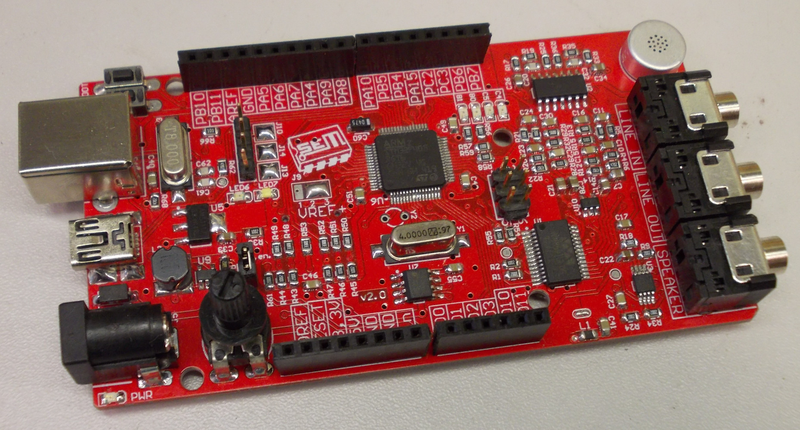

# dsp-tanfolyam-panel
Originally intended for teaching audio signal processing in 2014, this is a simple, Arduino-compatible development board using an STM32F405 microcontroller. It might not be my best design, but it works. Its form factor resembles the Arduino Uno, but it's a bit longer to give space to the audio codec.

## Features
- STM32F405RGT6 LQFP-64 microcontroller,
- Integrated ST-Link v2,
- USB bootloader can be used too,
- WM8591 24-bit I2S audio codec,
- TS486 headphone amplifier,
- Integrated microphone,
- SD card,
- 4 integrated LEDs,
- I2C EEPROM,
- Potentiometer (can be disconnected if not needed),
- Arduino form factor.

